## 👋 Hello world! 

#### I am an **electrical engineer** actively seeking technical and professional challenges in engineering projects.

I have experience and a strong interest in research and development of projects related to electronics, embedded systems, machine learning, and robotics.

## 🛠️ Skills

- 💻 Software Engineering
- ⚙️ Hardware Engineering
- 🚀 Systems Development
- 🚗 Embedded Systems
- ⚡ Electronics
- 🤖 Robotics
- 👁️ Computer Vision
- 📊 Data Science
- 📉 Machine Learning

## 📝 Publications

- [L. F. R. Mazzetto and J. E. C. Castanho, "FPGA-based Accelerator for Convolutional Neural Network Application in Mobile Robotics," 2023 Latin American Robotics Symposium (LARS), 2023 Brazilian Symposium on Robotics (SBR), and 2023 Workshop on Robotics in Education (WRE), Salvador, Brazil, 2023, pp. 433-438, doi: 10.1109/LARS/SBR/WRE59448.2023.10333052.](https://ieeexplore.ieee.org/document/10333052)

## 📈 Stats

